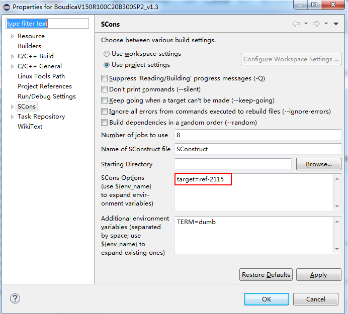
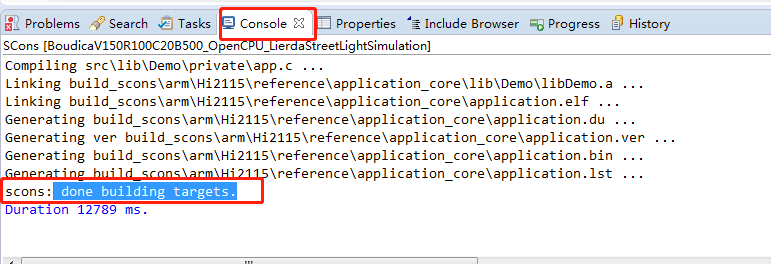
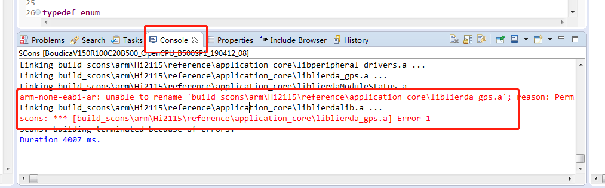
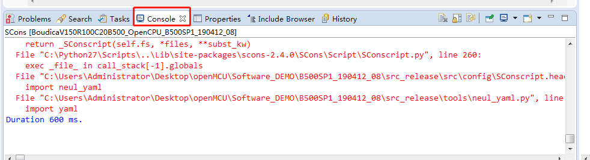
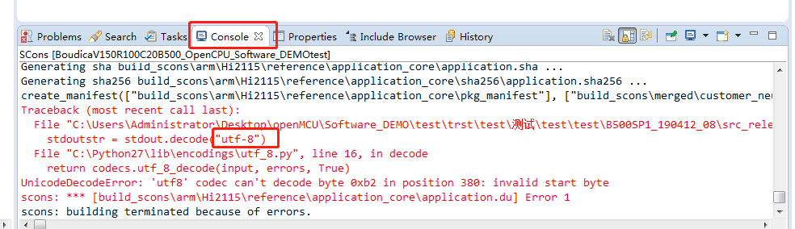

#  工程导入及代码编译
## 写在前面
本OpenCPU例程基于Lierda NB86-G EVK设计，集成NB86-G模组（基于海思Boudica 150 Hi2115芯片方案），EVK集成多种传感器：
- 温湿度
- 光强度
- 加速度
- GPS

支持两种NB-IoT应用的开发方式：
- 传统方式：传感器+MCU+NB86-G模组，即MCU作为应用载体，同时控制传感器采集状态并通过NB86-G模组收发数据
- OpenCPU：传感器+NB86-G模组，NB86-G模组同时作为应用软件及通信能力的载体，模组直接控制传感器采样，并将采集到的数据经过应用处理后与云端联动
> **OpenCPU开发方式相对于传统方式具有诸多优势**
> - 降低BOM成本，不再需要MCU
> - 降低功耗
> - 提高终端安全性
> - 提高集成度，对小尺寸终端设计有很大帮助
> - 模组内的应用可直接通过模组FOTA能力进行差分升级，方便后期维护
### 1.1. 相关资料
NB86-G EVK资料获取请移步：[NB86 EVK相关资料集](http://bbs.lierda.com/forum.php?mod=viewthread&tid=86&page=1&extra=&_dsign=91f69885)  
NB86-G EVK获取请移步：[NB86 EVK](https://item.taobao.com/item.htm?spm=a1z10.5-c.w4002-21080581561.13.565878241Htgvt&id=578262725191) 
LiteOS入门操作指南请移步[LiteOS内核教程](https://liteos.github.io/tutorials/kernel/)
### Lierda NB86 EVK
  
## 1 OpenCPU 工程导入

`注意：工程的路径和工程名不能包含中文；工程的路径尽量不要太深，5 层以内`

1.点击选项栏 `File`  
2.点击 `File` 子选项栏的 `Import... `进入导入工程界面如图 3-1，点击 `c/c++`选项栏，选择  `New SCons project from existing source`  单击下一步  

3.选择要导入的工程文件路径点击确定，填写相关信息，点击 `Finish`。  

  

## 2 代码编译
### 2.1编译相关配置
单机要编译的工程，快捷键Alt+Enter进入配置界面（或者鼠标右击要编译的工程 -> properties –>进入配置界面），点击SCons，选项框填写：target=ref-2115 如图
  
### 2.2编译步骤
选中工程鼠标右击要编译的工程 --> Build Project  
`NOTE：编译之前要对写好的工程进行保存，否则编译生成的application.bin文件没被更新`  
出现‘ done building targets’表示编译成功，如图
  
### 2.3常见编译出错解决办法
#### 2.3.1编译后报找不到xx.a库
若编译出错，如下图类似错误，请先Clean Project工程一下，然后在进行编译。若还是报错建议重复此操作多试几次。Clean Project工程方法：选中工程鼠标右击要Clean的工程 --> Clean Project.如图类似错误
  
#### 2.3.2编译后报.py导入出错
pyyaml库导入失败，如下图，解决办法：尝试重新安装pyyaml解决问题，安装方法见《OpenCPU开发环境搭建指南》 如图类似错误
 
#### 2.3.3环境变量未添加导致编译出错
若出现编译报找不到gcc编译器或者python找不到，请检查环境变量是否添加，确保环境变量添加成功。
#### 2.3.4编译后报编码问题
编译后报编码出错如下图，解决办法：工程路径中坚决不能出现中文路径，存放工程的路径不能太深，建议5层以内。如图类似错误
 

至此代码导入及代码编译已经完成，固件生成及烧录见下一小节

## 3 参考资料  
| 技术论坛 | OpenCPU资料 | NB86 EVK资料
| :----------- | :----------- | :----------- |
| [物联网开发者社区](http://bbs.lierda.com) |  [OpenCPU基本资料集](https://github.com/lierda-nb-iot-team/Lierda_OpenCPU_SDK) |  [NB86 EVK基本资料集](https://github.com/lierda-nb-iot-team/Lierda_NB86_EVK) |
