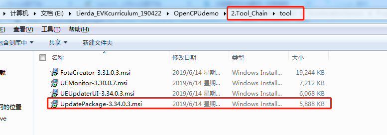
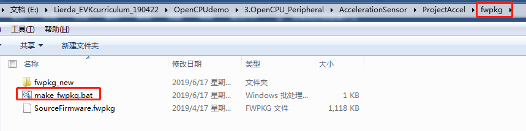
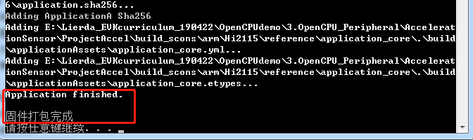
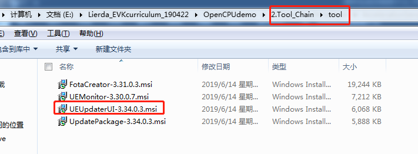

#  固件生成及烧录

## 1 Package包生成

由生成Package包的命令比较复杂，这里只对批处理的方式做说明，命令行方式详见《Lierda NB-IoT模组OpenCPU DEMO说明文档》第4小节。  
### 1.1	UpdatePackage软件安装
点击安装UpdatePackage固件生成软件。
  
NOTE: 需要安装与工程所对应的UpdatePackage版本  
### 1.2	Package包生成  
1、工程文件，进入fwpkg文件，找到make_fwpkg.bat文件如图，其中底包SourceFirmware.fwpkg文件根据自己的所使用的的硬件选择，这里提供B500SP1X0A固件底包，若跟换底包需将底包名改为“SourceFirmware.fwpkg”。 
  
2、点击运行该批处理文件，若无异常出现则表示固件生成成功，如图 
  
3、make_fwpkg.bat批处理文件运行完成后，在fwpkg_new文件夹下就会生成相应的固件如图
  

## 2固件烧录
### 2.1UEUpdaterUI软件安装
  
点击安装UEUpdaterUI软件。  
`NOTE：需要安装与工程所对应的UEUpdaterUI版本。`

### 2.2固件烧录
选择1.2小节生成固件，UEUpdaterUI软件中勾选write KV，点击update进行烧录如图。
  
`NOTE:烧录前需保证生成的固件是和开发的模组硬件相符合（Package包生成时保证底包无误）。若不符合可能会出现异常，若出现异常请参考《Lierda NB-IoT模组OpenCPU DEMO说明文档》5小节进行烧录。`  

## 3 参考资料  

| 技术论坛 | OpenCPU资料 | NB86 EVK资料
| :----------- | :----------- | :----------- |
| [物联网开发者社区](http://bbs.lierda.com) |  [OpenCPU基本资料集](https://github.com/lierda-nb-iot-team/Lierda_OpenCPU_SDK) |  [NB86 EVK基本资料集](https://github.com/lierda-nb-iot-team/Lierda_NB86_EVK) |
