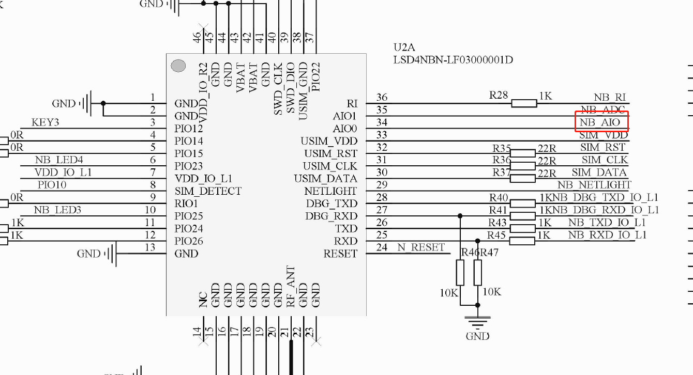
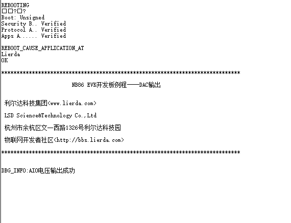

# DAC输出例程
## 写在前面
本OpenCPU例程基于Lierda NB86-G EVK设计，集成NB86-G模组（基于海思Boudica 150 Hi2115芯片方案），EVK集成多种传感器：
- 温湿度
- 光强度
- 加速度
- GPS

支持两种NB-IoT应用的开发方式：
- 传统方式：传感器+MCU+NB86-G模组，即MCU作为应用载体，同时控制传感器采集状态并通过NB86-G模组收发数据
- OpenCPU：传感器+NB86-G模组，NB86-G模组同时作为应用软件及通信能力的载体，模组直接控制传感器采样，并将采集到的数据经过应用处理后与云端联动
> **OpenCPU开发方式相对于传统方式具有诸多优势**
> - 降低BOM成本，不再需要MCU
> - 降低功耗
> - 提高终端安全性
> - 提高集成度，对小尺寸终端设计有很大帮助
> - 模组内的应用可直接通过模组FOTA能力进行差分升级，方便后期维护
### 相关资料
NB86-G EVK资料获取请移步：[NB86 EVK相关资料集](http://bbs.lierda.com/forum.php?mod=viewthread&tid=86&page=1&extra=&_dsign=91f69885) 
### 1 简介

本例程为DAC输出的控制例程，对应目录如下：

- ProjectLight
  - src
    - lib
      - Demo

### 2 要点

- DAC相关接口的常规用法

### 3 实验条件

硬件：Lierda NB86 EVK/NB86-G模组  
软件：USB转串口驱动  
集成开发环境：Eclipse  

### 4 电气连接

### 5 实验步骤
5.1 将`ProjectLight`文件夹导入eclipse，导入方法详见[《Lierda NB-IoT模组 OpenCPU DemoCode说明文档》
](../../Doc/基本资料/Lierda_NB-IoT模组OpenCPU_DEMO说明文档V1.8_190403.pdf)
5.2 打开`Demo`文件夹下示例代码：  

5.3 例程详解  
5.3.1 涉及库函数及对应头文件  
- DAC相关库函数  
头文件：  
`#include "lierdaDAC.h"`  
库函数：  
`LIERDA_DAC_RET lierdaDACInit(void);//DAC初始化`  
`LIERDA_DAC_RET lierdaDACWriteRaw(uint32 value);//DAC输出`  
`LIERDA_DAC_RET lierdaDACConnect(uint32 aio);//初始化输出的IO口`  
`LIERDA_DAC_RET lierdaDACSetRange(DAC_VOLTAGE_RANGE range);//设置电压范围`  

5.3.3  编译工程，如没有错误则编译通过：  
  
编译成功后，烧写固件，烧写过程详见[《Lierda NB-IoT模组 OpenCPU DemoCode说明文档》
](../../Doc/基本资料/Lierda_NB-IoT模组OpenCPU_DEMO说明文档V1.8_190403.pdf)
5.3.4 烧写完毕，打开串口助手，选择AT串口，波特率为9600，可看到如下结果：  

### 6 注意事项

注意在DAC输出前需要设定电压范围和连接到要输出的IO口  

### 7 参考资料

| 技术论坛 |
| :----------- |
| [物联网开发者社区](http://bbs.lierda.com) |
