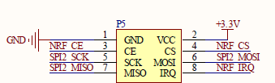

# Flash读写操作例程

### 1 简介

本例程使用Lierda OpenCPU 库函数实现Flash读写操作例程，对应目录如下：

- ProjectLight
  - src
    - lib
      - Demo

### 2 要点

- SPI接口函数常规用法
- Flash读写常规操作

### 3 实验条件

硬件：Lierda NB86 EVK/NB86-G模组  
软件：USB转串口驱动  
集成开发环境：Eclipse  

### 4 电气连接



### 5 实验步骤
5.1 将`ProjectLight`文件夹导入eclipse，导入方法详见[《Lierda NB-IoT模组 OpenCPU DemoCode说明文档》
](../../Doc/基本资料/Lierda_NB-IoT模组OpenCPU_DEMO说明文档V1.8_190403.pdf)

5.2 打开`Demo`文件夹下示例代码：  


5.3 例程详解  
5.3.1 涉及库函数及对应头文件  
- 硬件SPI相关库函数  
头文件：	
`#include "lierdaSPI.h"`  
库函数:  
``` cpp
SPI_RET lierdaSPIInit(SPI_CONFIGURATION spi_config, SPI_PIN spi_pin);//SPI初始化函数  
SPI_RET lierdaSPISendData(SPI_BUS bus, uint8* cmd_buff,uint16 cmd_len, uint8* data_buff, uint16 data_len, SPI_CALLBACK callback);//SPI数据发送函数  
SPI_RET lierdaSPIRecvData(SPI_BUS bus, uint8* cmd_buff, uint16 cmd_len, uint8* data_buff, uint16 data_len, SPI_CALLBACK callback, bool ignore_rx_while_tx);//SPI数据接收函数  
```  
- 软件SPI相关库函数  	
头文件：	
`#include "lierdaSPIsoft.h"`
库函数：  
``` cpp	 
uint8 lierdaSPISoftInit(SPI_InitTypeDef *SPI_Init);//SPI初始化函数  uint8 lierdaSPIWriteByte(SPI_InitTypeDef *lierda_spi,uint8 TxData);//SPI数据发送函数  
uint8 lierdaSPIReadByte(SPI_InitTypeDef *lierda_spi);//SPI数据接收函数  
```  
5.3.2 MX25L12835F Flash驱动  

Flash初始化：Flash相关配置，详见例程代码中	void MX25L12835F_spiInit(void)函数。

Flash 芯片ID读取：通过SPI的读写操作读取Flash芯片的ID，详见例程代码中
uint32 SFLASH_ReadID(void)函数。

Flash数据读写操作：通过使用SPI的读写函数，对Flash进行读写操作。详见例程代码中void Lierda_SPITest(void)函数。


5.4  编译工程，如没有错误则编译通过：  
  
编译成功后，烧写固件，烧写过程详见[《Lierda NB-IoT模组 OpenCPU DemoCode说明文档》
](../../Doc/基本资料/Lierda_NB-IoT模组OpenCPU_DEMO说明文档V1.8_190403.pdf)

5.5 烧写完毕，打开串口助手，选择AT串口，波特率为9600，可看到如下结果：  


### 6 注意事项

- 定义使用的Flash引脚需处于同一电源域。


### 7 参考资料

| 技术论坛 | OpenCPU资料 | NB86 EVK资料
| :----------- | :----------- | :----------- |
| [物联网开发者社区](http://bbs.lierda.com) |  [OpenCPU基本资料集](https://github.com/lierda-nb-iot-team/Lierda_OpenCPU_SDK) |  [NB86 EVK基本资料集](https://github.com/lierda-nb-iot-team/Lierda_NB86_EVK) |