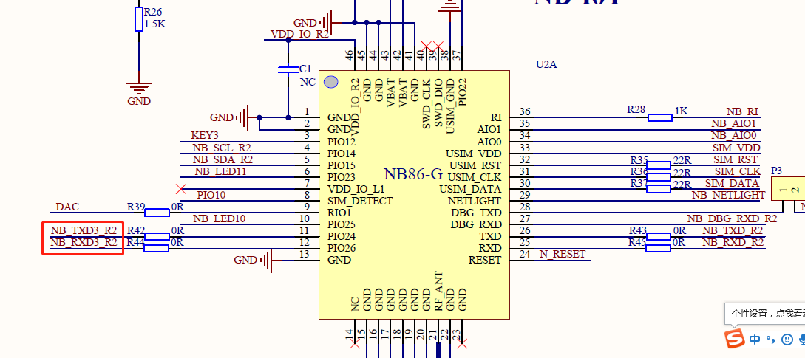
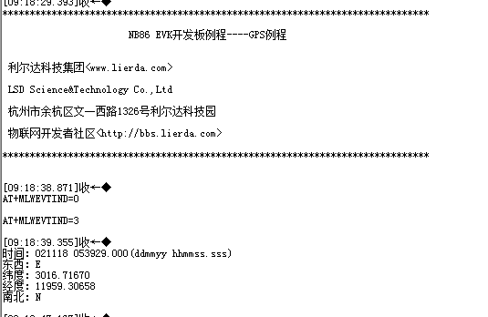

# GPS数据解析例程

### 1 简介

本例程使用Lierda OpenCPU 库函数实现华大北斗GPS数据获取及解析的效果，对应目录如下：

- ProjectLight
  - src
    - lib
      - Demo

### 2 要点

- UART接口函数常规用法
- 华大北斗报文解析

### 3 实验条件

硬件：Lierda NB86 EVK/NB86-G模组  
软件：USB转串口驱动  
集成开发环境：Eclipse  

### 4 电气连接



### 5 实验步骤
5.1 将`ProjectLight`文件夹导入eclipse，导入方法详见[《Lierda NB-IoT模组 OpenCPU DemoCode说明文档》
](https://github.com/lierda-nb-iot-team/Lierda_OpenCPU_SDK)

5.2 打开`Demo`文件夹下示例代码：  


5.3 例程详解  
5.3.1 涉及库函数及对应头文件  
- UART相关库函数 
头文件：  
`#include "lierdaUART.h"`  
库函数： 
``` cpp 
void lierdaUARTInit(UART_HandleTypeDef *huart);//UART初始化  
uint16 lierdaUARTReceive(UART_HandleTypeDef *huart,uint8 *UserDataPtr, uint16 *UserDataLen, uint32 WaitTimeOut);//UART数据接收函数  
void lierdaUARTSend(UART_HandleTypeDef *huart,const uint8 *buffer, uint32 length);//UART数据发送函数  
```  
5.3.2 华大北斗数据接收

串口初始化：对GPS所用的串口进行初始化操作，详见例程代码中void GPS_uart_init(void)函数。
数据接收：用一个任务来做数据接收，详见例程代码中void lierda_Gps_task(void *argument)任务。

5.3.3 华大北斗数据解析

当GPS数据接收完毕后开始解析报文信息，详见例程代码中uint32 iRMC_decode(char* buff,uint32 len)函数。

5.4  编译工程，如没有错误则编译通过：  
  
编译成功后，烧写固件，烧写过程详见[《Lierda NB-IoT模组 OpenCPU DemoCode说明文档》
](https://github.com/lierda-nb-iot-team/Lierda_OpenCPU_SDK)

5.5 烧写完毕，打开串口助手，选择AT串口，波特率为9600，可看到如下结果：  


### 6 注意事项

- 定义RX和TX引脚最好处于同一电源域。


### 7 参考资料

| 技术论坛 | OpenCPU资料 | NB86 EVK资料
| :----------- | :----------- | :----------- |
| [物联网开发者社区](http://bbs.lierda.com) |  [OpenCPU基本资料集](https://github.com/lierda-nb-iot-team/Lierda_OpenCPU_SDK) |  [NB86 EVK基本资料集](https://github.com/lierda-nb-iot-team/Lierda_NB86_EVK) |