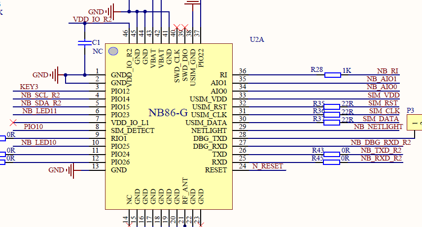
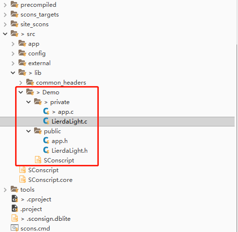
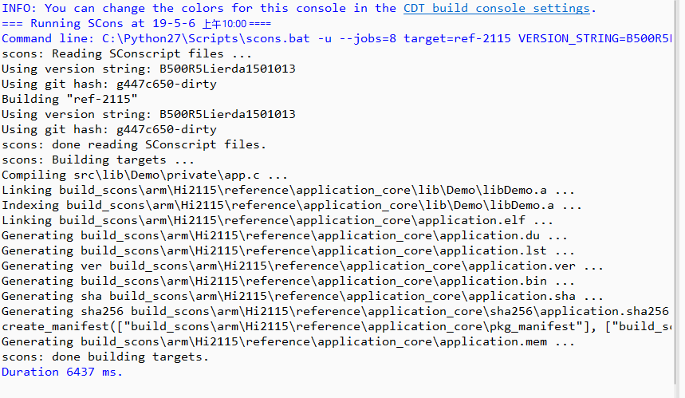

# FOTA测试例程

### 1 简介

本例程使用Lierda OpenCPU 库函数实现FOTA规避，用于规避发生FOTA事件时发数据可能导致异常发生，对应目录如下：

- ProjectLight
  - src
    - lib
      - Demo

### 2 要点

- FOTA规避接口函数常规用法
- 事件状态相关接口

### 3 实验条件

硬件：Lierda NB86 EVK/NB86-G模组  
软件：USB转串口驱动  
集成开发环境：Eclipse  

### 4 电气连接

### 5 实验步骤
5.1 将`ProjectLight`文件夹导入eclipse，导入方法详见[《Lierda NB-IoT模组 OpenCPU DemoCode说明文档》
](https://github.com/lierda-nb-iot-team/Lierda_OpenCPU_SDK)

5.2 打开`Demo`文件夹下示例代码：  

5.3 例程详解  
5.3.1 涉及库函数及对应头文件
  
- 事件状态相关库函数  
头文件：  
`#include "lierda_module_status.h"`  
库函数：  
`void lierda_module_status_read(void);	//用于事件状态更新`

- FOTA规避相关库函数  
头文件：  
`#include "lierda_module_status.h"`  
库函数：  
`lierda_fotaSta lierda_FotaStatus(void);//FOTA状态查询函数`

`lierdaFota lierda_FotaEnableData(void);//FOTA是否可以做业务函数`

5.3.2 FOTA规避相关说明

- 由于在发生FOTA时进行发数据操作就可能造成模组异常的发生，所以在软件设计时要把FOTA规避考虑进去，详见例程中的示例代码。

- FOTA相关操作（差分包生成，签名，上传，FOTA任务下发）请参考[《OpenCPU_FOTAApplicationNote》
](../../Doc/应用笔记/Lierda NB86-G OpenCPU_FOTAApplicationNote_V1.0.20190403.pdf)。

5.4  编译工程，如没有错误则编译通过：  
  
编译成功后，烧写固件，烧写过程详见[《Lierda NB-IoT模组 OpenCPU DemoCode说明文档》
](https://github.com/lierda-nb-iot-team/Lierda_OpenCPU_SDK)

5.5 烧写完毕，打开串口助手，选择AT串口，波特率为9600，可看到如下结果：

1、FOTA前正常发数据

2、FOTA中不允许发数据

3、FOTA结束正常发数据

### 6 注意事项

- FOTA过程中不能进行发数据操作

### 7 参考资料

| 技术论坛 |
| :----------- |
| [物联网开发者社区](http://bbs.lierda.com) |