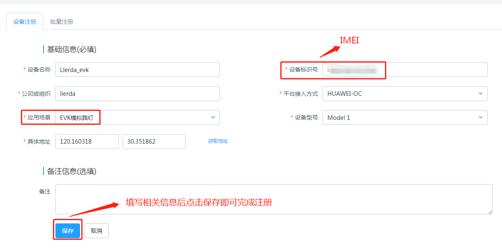
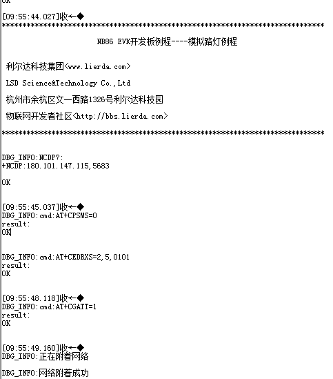
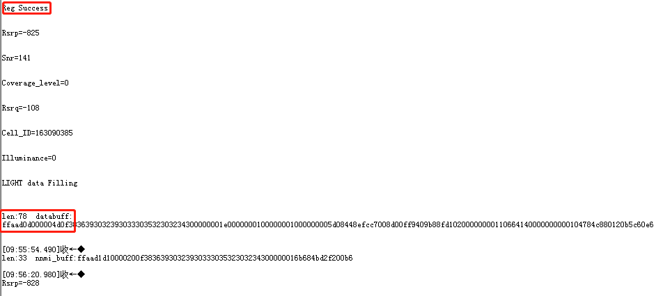
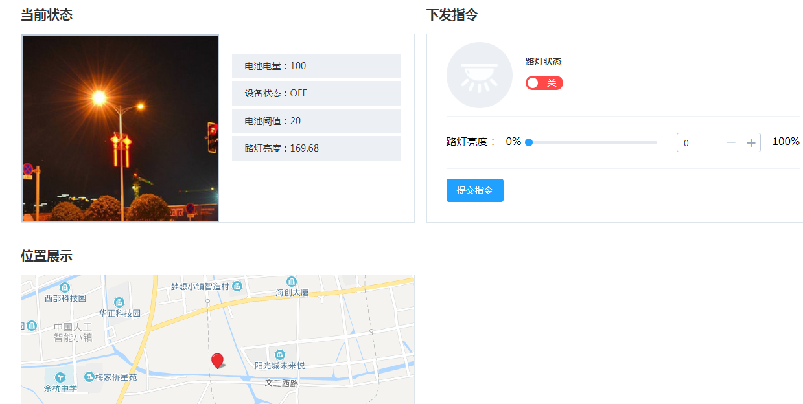
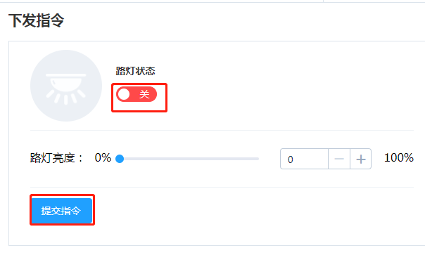
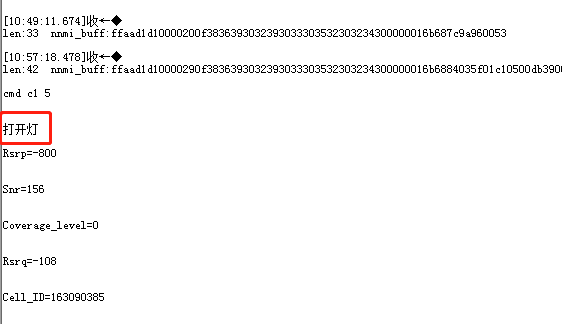

# 模拟路灯例程

### 1 简介

本例程使用Lierda OpenCPU 方案实现一个综合性的例程（模拟路灯场景）,例程对应目录如下：

- ProjectLight
  - src
    - lib
      - Demo

### 2 要点

- 掌握Lierda NB模组OPenCPU方案常用函数接口使用
- 了解OpenCPU方案开发思想

### 3 实验条件

硬件：Lierda NB86 EVK/NB86-G模组  
软件：USB转串口驱动、[NB-IoT调试平台 ](http://nbiot.iot-ism.com)  
集成开发环境：Eclipse  

### 4 电气连接
例程在NB86 EVK的硬件上开发，硬件资源请参考：[NB86 EVK基本资料集](https://github.com/lierda-nb-iot-team/Lierda_NB86_EVK)
### 5 实验步骤
5.1 将`ProjectLight`文件夹导入eclipse，导入方法详见[《Lierda NB-IoT模组 OpenCPU DemoCode说明文档》
](https://github.com/lierda-nb-iot-team/Lierda_OpenCPU_SDK)

5.2 打开`Demo`文件夹下示例代码：  

5.3 例程详解  
此例程是对前面外设部分的应用，涉及的驱动较多，详细例程见源码。  

5.4  编译工程，如没有错误则编译通过：  
  
编译成功后，烧写固件，烧写过程详见[《Lierda NB-IoT模组 OpenCPU DemoCode说明文档》
](https://github.com/lierda-nb-iot-team/Lierda_OpenCPU_SDK)

5.5结果呈现  
5.5.1设备注册  
综合应用例程上报的数据都在[NB-IoT调试平台 ](http://nbiot.iot-ism.com)呈现，故首先要在调测平台注册对应场景的设备。如下图
  
5.5.2数据上报  
烧写完毕，打开串口助手，选择AT串口，波特率为9600，可看到如下结果：
  
待平台注册成功后模组会上报模拟路灯的数据至平台，如下图  
   
 
5.5.3命令下发  
点击路灯开关下发命令，EVK上LED10用来指示命令状态（LED10点亮表示路灯开，相反灭表示路灯关）。从串口调试助手也可看出命令状态，如图：  
   
 

### 6 参考资料

| 技术论坛 | OpenCPU资料 | NB86 EVK资料
| :----------- | :----------- | :----------- |
| [物联网开发者社区](http://bbs.lierda.com) |  [OpenCPU基本资料集](https://github.com/lierda-nb-iot-team/Lierda_OpenCPU_SDK) |  [NB86 EVK基本资料集](https://github.com/lierda-nb-iot-team/Lierda_NB86_EVK) |
