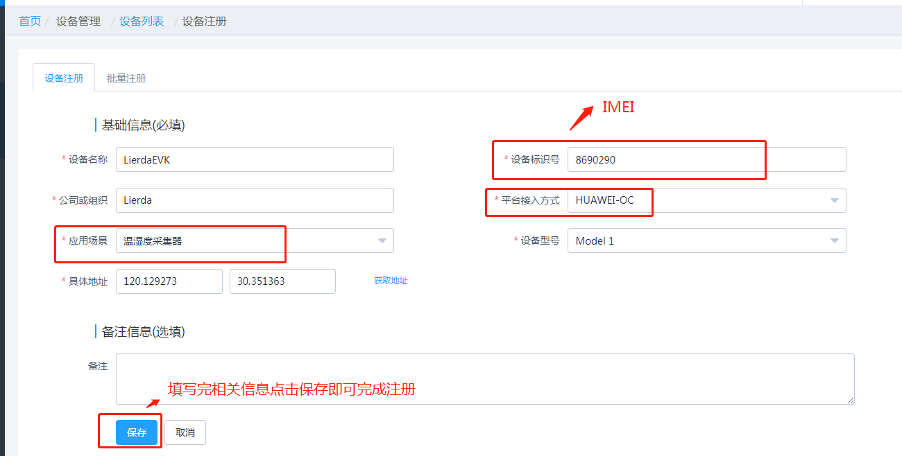
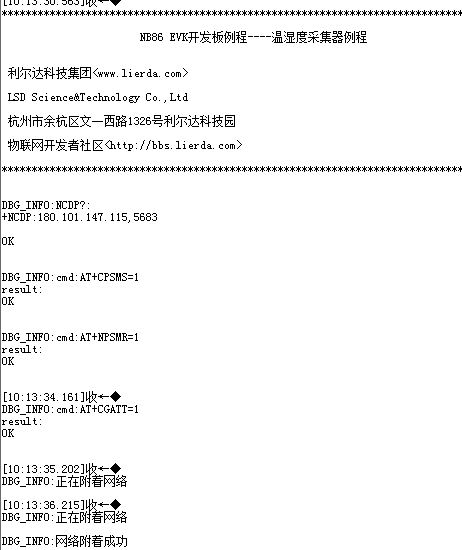
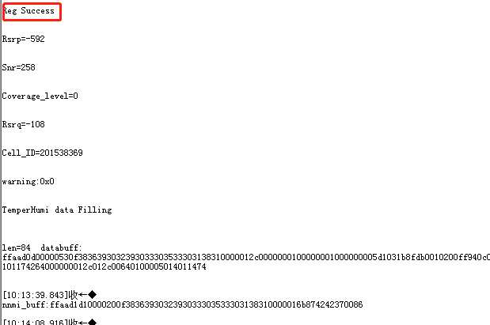
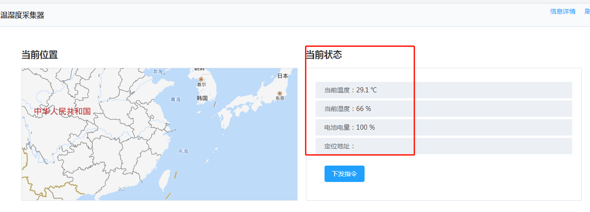
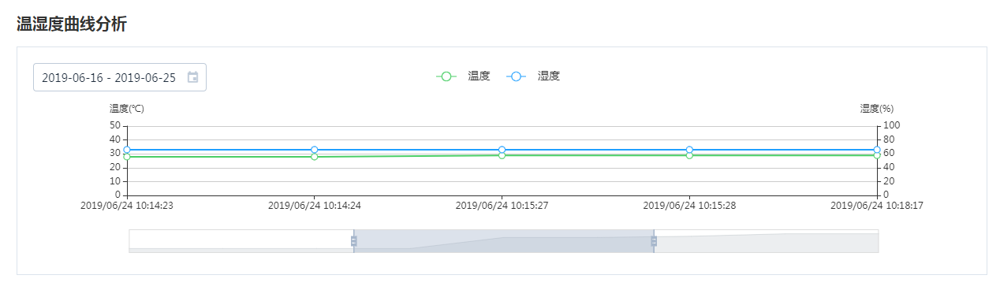
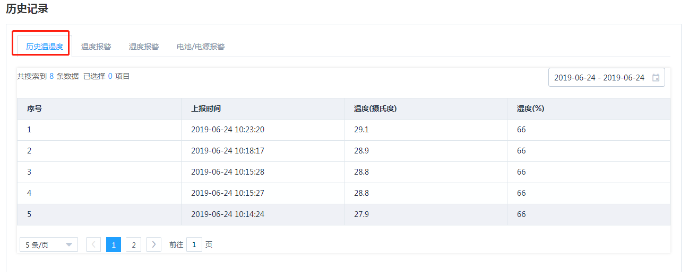
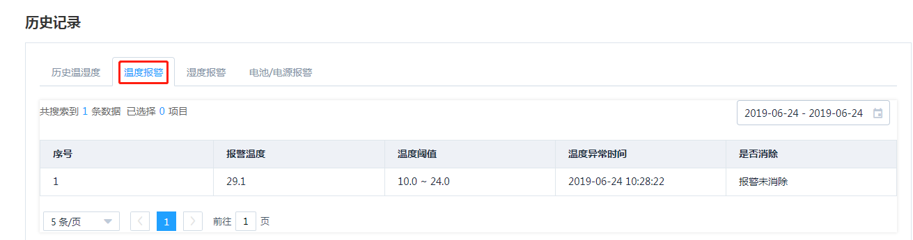
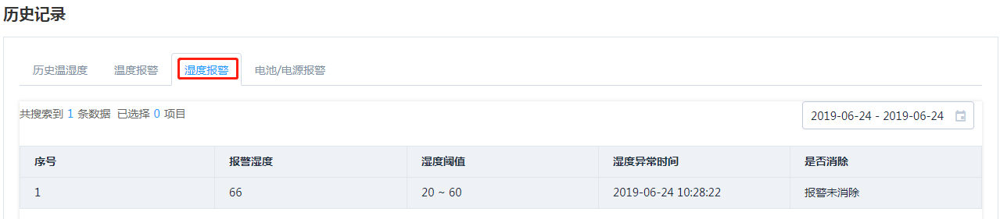
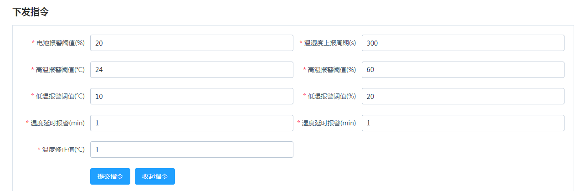
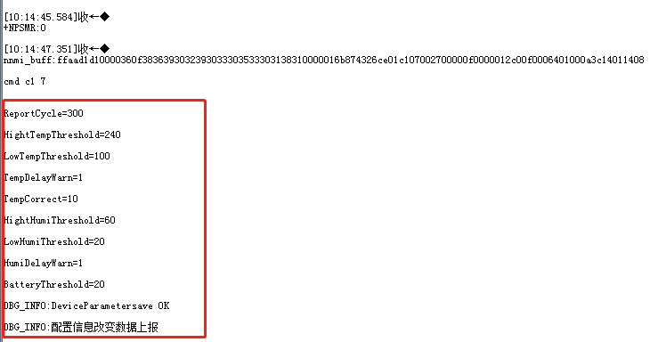

# 温湿度采集器例程
## 写在前面
本OpenCPU例程基于Lierda NB86-G EVK设计，集成NB86-G模组（基于海思Boudica 150 Hi2115芯片方案），EVK集成多种传感器：
- 温湿度
- 光强度
- 加速度
- GPS

支持两种NB-IoT应用的开发方式：
- 传统方式：传感器+MCU+NB86-G模组，即MCU作为应用载体，同时控制传感器采集状态并通过NB86-G模组收发数据
- OpenCPU：传感器+NB86-G模组，NB86-G模组同时作为应用软件及通信能力的载体，模组直接控制传感器采样，并将采集到的数据经过应用处理后与云端联动
> **OpenCPU开发方式相对于传统方式具有诸多优势**
> - 降低BOM成本，不再需要MCU
> - 降低功耗
> - 提高终端安全性
> - 提高集成度，对小尺寸终端设计有很大帮助
> - 模组内的应用可直接通过模组FOTA能力进行差分升级，方便后期维护
### 相关资料
NB86-G EVK资料获取请移步：[NB86 EVK相关资料集](http://bbs.lierda.com/forum.php?mod=viewthread&tid=86&page=1&extra=&_dsign=91f69885)  
NB86-G EVK获取请移步：[NB86 EVK](https://item.taobao.com/item.htm?spm=a1z10.5-c.w4002-21080581561.13.565878241Htgvt&id=578262725191) 
LiteOS入门操作指南请移步[LiteOS内核教程](https://liteos.github.io/tutorials/kernel/)
### Lierda NB86 EVK
   
### 1 简介

本例程使用Lierda OpenCPU 方案实现一个综合性的例程（温湿度采集器）,例程对应目录如下：

- ProjectLight
  - src
    - lib
      - Demo

### 2 要点

- 掌握Lierda NB模组OPenCPU方案常用函数接口使用
- 了解OpenCPU方案开发思想

### 3 实验条件

硬件：Lierda NB86 EVK/NB86-G模组  
软件：USB转串口驱动、[NB-IoT调试平台 ](http://nbiot.iot-ism.com)  
集成开发环境：Eclipse  

### 4 电气连接
例程在NB86 EVK的硬件上开发，硬件资源请参考：[NB86 EVK基本资料集](https://github.com/lierda-nb-iot-team/Lierda_NB86_EVK)
### 5 实验步骤
5.1 将`ProjectLight`文件夹导入eclipse，导入方法详见[《Lierda NB-IoT模组 OpenCPU DemoCode说明文档》
](https://github.com/lierda-nb-iot-team/Lierda_OpenCPU_SDK)

5.2 打开`Demo`文件夹下示例代码：  

5.3 例程详解  
此例程是对前面外设部分的应用，涉及的驱动较多，详细例程见源码。  

5.4  编译工程，如没有错误则编译通过：  
  
编译成功后，烧写固件，烧写过程详见[《Lierda NB-IoT模组 OpenCPU DemoCode说明文档》
](https://github.com/lierda-nb-iot-team/Lierda_OpenCPU_SDK)

5.5结果呈现  
5.5.1设备注册  
综合应用例程上报的数据都在[NB-IoT调试平台 ](http://nbiot.iot-ism.com)呈现，故首先要在调测平台注册对应场景的设备。如下图
  
5.5.2数据上报  
烧写完毕，打开串口助手，选择AT串口，波特率为9600，可看到如下结果：
  
待平台注册成功后模组会上报温湿度数据至平台，如下图  
   
待数据上传成功后可在如下几个地方查看数据：  
1、当前状态（温湿度数据包不上报GPS信息，故当前位置不显示）
 
2、温湿度曲线分析  
  
3、历史记录  
   
  
  
5.5.3命令下发  
点击下发指令，填写温湿度采集器相关配置后提交指令即可，如图： 
   
 

### 6 参考资料

| 技术论坛 | OpenCPU资料 | NB86 EVK资料
| :----------- | :----------- | :----------- |
| [物联网开发者社区](http://bbs.lierda.com) |  [OpenCPU基本资料集](https://github.com/lierda-nb-iot-team/Lierda_OpenCPU_SDK) |  [NB86 EVK基本资料集](https://github.com/lierda-nb-iot-team/Lierda_NB86_EVK) |
