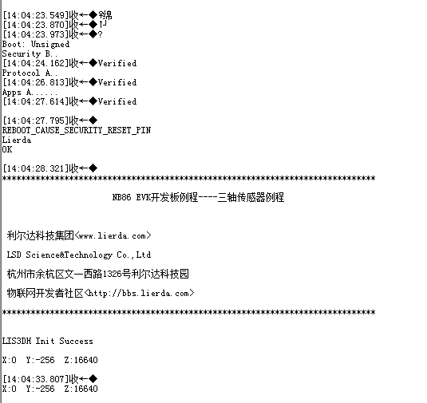

# 三轴加速度传感器例程

### 1 简介

本例程使用Lierda OpenCPU 库函数实现三轴加速度传感器数据采集，对应目录如下：

- ProjectLight
  - src
    - lib
      - Demo

### 2 要点

- I2C接口函数常规用法
- 三轴传感器 LIS3DH 常规用法

### 3 实验条件

硬件：Lierda NB86 EVK/NB86-G模组  
软件：USB转串口驱动  
集成开发环境：Eclipse  

### 4 电气连接

### 5 实验步骤
5.1 将`ProjectLight`文件夹导入eclipse，导入方法详见[《Lierda NB-IoT模组 OpenCPU DemoCode说明文档》
](../../Doc/基本资料/Lierda_NB-IoT模组OpenCPU_DEMO说明文档V1.8_190403.pdf)

5.2 打开`Demo`文件夹下示例代码：  

5.3 例程详解  
5.3.1 涉及库函数及对应头文件  
- I2C相关库函数  
头文件：  
`#include "lierdaI2C.h"`  
库函数：  
`HAL_StatusTypeDef lierdaI2CInit(I2C_HandleTypeDef *hi2c);	//I2C初始化`

`I2C_RET lierdaI2CWrite(I2C_HandleTypeDef *hi2c,uint8 i2c_slave_addr,uint8 *data,uint8 data_len);	//I2C写数据函数`

`I2C_RET lierdaI2CRead(I2C_HandleTypeDef *hi2c,uint8 i2c_slave_addr,uint8 *data, uint8 data_len); 	//I2C读取数据函数`

5.3.2 三轴传感器驱动

三轴传感器初始化：配置三轴传感器的寄存器，详见例程代码中uint8 LIS3DH_init(void)函数。

三轴数据获取：通过I2C的读写寄存器操作读取三轴数据，详见例程代码中
void LIS3DHUpdateInfo(int16 *LIS3DH_X,int16 *LIS3DH_Y,int16 *LIS3DH_Z)函数。

5.4  编译工程，如没有错误则编译通过：  
  
编译成功后，烧写固件，烧写过程详见[《Lierda NB-IoT模组 OpenCPU DemoCode说明文档》
](../../Doc/基本资料/Lierda_NB-IoT模组OpenCPU_DEMO说明文档V1.8_190403.pdf)

5.5 烧写完毕，打开串口助手，选择AT串口，波特率为9600，可看到如下结果：  

### 6 注意事项

- 定义SCL和SDA引脚最好处于同一电源域。

### 7 参考资料

| 技术论坛 |
| :----------- |
| [物联网开发者社区](http://bbs.lierda.com) |
