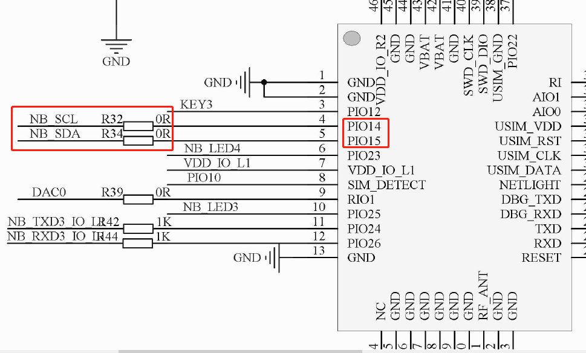
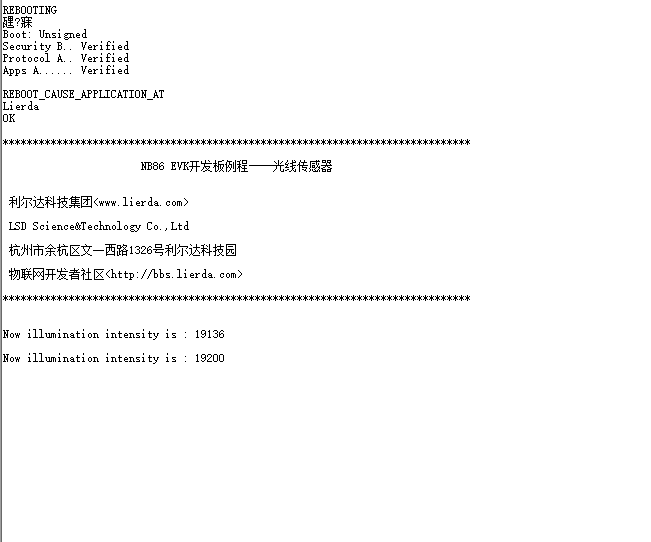
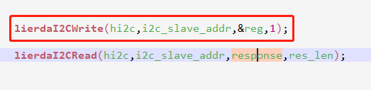

# 光线传感器例程

### 1 简介

本例程为光线传感器的控制例程，对应目录如下：

- ProjectLight
  - src
    - lib
      - Demo

### 2 要点

- I2C相关接口的常规用法
- OPT3001光线传感器库函数的常规用法

### 3 实验条件

硬件：Lierda NB86 EVK/NB86-G模组  
软件：USB转串口驱动  
集成开发环境：Eclipse  

### 4 电气连接

### 5 实验步骤
5.1 将`ProjectLight`文件夹导入eclipse，导入方法详见[《Lierda NB-IoT模组 OpenCPU DemoCode说明文档》
](../../Doc/基本资料/Lierda_NB-IoT模组OpenCPU_DEMO说明文档V1.8_190403.pdf)  

5.2 打开`Demo`文件夹下示例代码：  

5.3 例程详解  
5.3.1 涉及库函数及对应头文件  
- I2C相关库函数  
头文件：  
`#include "lierdaI2C.h"`  
库函数：  
`HAL_StatusTypeDef lierdaI2CInit(I2C_HandleTypeDef *hi2c);//I2C初始化`  
`I2C_RET lierdaI2CRead(I2C_HandleTypeDef *hi2c,uint8 i2c_slave_addr,uint8 *data, uint8 data_len);//读操作`  
`I2C_RET lierdaI2CWrite(I2C_HandleTypeDef *hi2c,uint8 i2c_slave_addr,uint8 *data,uint8 data_len);//写操作`  

- OPT3001相关库函数  
头文件：  
`#include "lierda_OPT3001DN.h"`  
库函数：  
`uint8 lierda_OPT3001_Init(void);//初始化芯片，包括验证出厂ID等`  
`void lierda_OPT3001_UpdataInfo(uint32 *Lux);//获取更新的传感器数值`  

5.3.2 在使用I2C读写接口时，建议根据传感器芯片特性封装相应的函数，例如：  
  

5.4  编译工程，如没有错误则编译通过：  
  
编译成功后，烧写固件，烧写过程详见[《Lierda NB-IoT模组 OpenCPU DemoCode说明文档》
](../../Doc/基本资料/Lierda_NB-IoT模组OpenCPU_DEMO说明文档V1.8_190403.pdf)
5.5 烧写完毕，打开串口助手，选择AT串口，波特率为9600，可看到如下结果：  

### 6 注意事项

- 需要注意的是在使用I2C读写的时候要根据当前传感器芯片的特性进行操作，例如，这款光线传感器在读取寄存器数值的时候需要先写入寄存器的地址：  

### 7 参考资料

| 技术论坛 |
| :----------- |
| [物联网开发者社区](http://bbs.lierda.com) |
