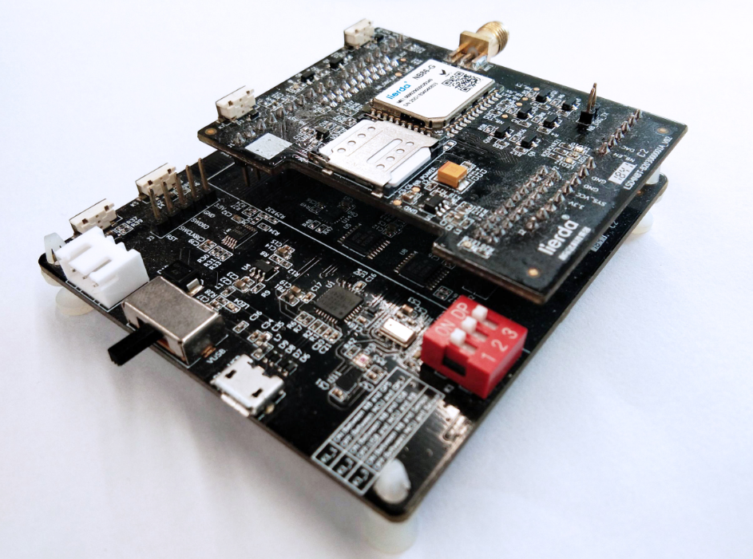

<h1 align="center">
  Lierda NB-IoT OpenCPU Tutorial
</h1>

<h4 align="center">
  👋 Lierda NB-IoT Team
</h4>

  <!-- <a href="https://travis-ci.org/lierda-nb-iot-team/OpenCPUdemo"> -->
    
  <!-- </a> -->
  

<!-- <h3 align="center">
  <a href="./README_EN.md">
  Change to English
</h3> -->

# OpenCPU Tutorial
## 1 写在前面
本OpenCPU例程基于Lierda NB86-G EVK设计，集成NB86-G模组（基于海思Boudica 150 Hi2115芯片方案），EVK集成多种传感器：
- 温湿度
- 光强度
- 加速度
- GPS

支持两种NB-IoT应用的开发方式：
- 传统方式：传感器+MCU+NB86-G模组，即MCU作为应用载体，同时控制传感器采集状态并通过NB86-G模组收发数据
- OpenCPU：传感器+NB86-G模组，NB86-G模组同时作为应用软件及通信能力的载体，模组直接控制传感器采样，并将采集到的数据经过应用处理后与云端联动
> **OpenCPU开发方式相对于传统方式具有诸多优势**
> - 降低BOM成本，不再需要MCU
> - 降低功耗
> - 提高终端安全性
> - 提高集成度，对小尺寸终端设计有很大帮助
> - 模组内的应用可直接通过模组FOTA能力进行差分升级，方便后期维护
### 1.1. 相关资料
NB86-G EVK资料获取请移步：[NB86 EVK相关资料集](http://bbs.lierda.com/forum.php?mod=viewthread&tid=86&page=1&extra=&_dsign=91f69885)  
NB86-G EVK获取请移步：[NB86 EVK](https://item.taobao.com/item.htm?spm=a1z10.5-c.w4002-21080581561.13.565878241Htgvt&id=578262725191)
   
LiteOS入门操作指南请移步[LiteOS内核教程](https://liteos.github.io/tutorials/kernel/)

## 2 例程

Lierda OpenCPU例程旨在推广基于NB86-G模组的OpenCPU应用开发方案，降低用户对该开发方案的接受门槛，能够快速开发并集成特定应用，降低成本，为用户大幅节省开发周期。

> 每个工程文件夹内包含`.fwpkg固件包`可直接烧录查看实验效果

| 目录 | 内容 |
| :----------- | :--------------- |
| 1.Reference   | OpenCPU相关资料说明|
| 2.Tool_Chain | 工具链的搭建及开发所需的软件|
| 3.OpenCPU_Peripheral| OpenCPU外设相关例程|
| 4.Network_Communication | OpenCPU网络连接及FOTA升级相关例程|
| 5.Application_Demo | 综合应用例程（模拟水表、路灯、温湿度采集器、定位器）|

## 2.1. Tool_Chain
介绍NB86-G模组的OpenCPU开发环境搭建过程，用户按照例程顺序执行即可快速完成OpenCPU开发环境搭建、示例工程导入，编译烧写等基础开发过程。   

| 目录              | 内容 |
| :--------------- | :---------------------------- |
| 1.开发环境搭建| 开发环境搭建说明|
|2.工程导入及代码编译|工程导入及代码编译说明|
|3.固件生成及烧录|固件生成及烧录说明|
|tool|开发所需软件|
## 2.2. OpenCPU_Peripheral
罗列了目前NB86-G模组能够支持用户使用的外设资源，并根据外设特点基于NB86 EVK设计直观的实验，用户可以快速熟悉能够结合到自身产品的多种外设。   

| 目录              | 内容 |
| :--------------- | :---------------------------- |
| VBAT voltage acquisition| Vbat脚电压相关使用例程及说明文档|
| Temperature and humidity sensor data acquisition| HDC1000温湿度传感器相关使用例程及说明文档|
| Acceleration sensor| LIS3DH三轴加速度传感器相关类使用例程及说明文档|
| LED flashing| LED灯使用例程及说明文档 |
| Light sensor| 光线传感器使用例程及说明文档 |
| GPS sensor data acquisition| GPS芯片相关使用例程及说明文档|
| Button| 按键中断相关使用例程及明文档|
| Analog measurement（ADC）| ADC采样相关使用例程及说明文档|
| Analog output（DAC）| DAC输出相关使用例程及说明文档|
| Low power adaptation | 低功耗使用例程及说明文档 |
| Breathing light | 呼吸灯PWM输出使用例程及说明文档 |
| Flash memory | SPI读写FLASH使用例程及说明文档 |

## 2.3. Network Communication 
展示如何基于OpenCPU方案进行网络通信，对接OceanConnect平台，适配FOTA需要注意的要点等重要功能。   

| 目录              | 内容 |
| :--------------- | :---------------------------- |
| Search network and Attach| 网络连接相关使用例程及说明文档|
| UDP send and receive data| UDP数据收发相关使用例程及说明文档|
| TCP send and receive data| TCP数据收发相关使用例程及说明文档|
| LwM2M send and receive data| LwM2M数据收发相关使用例程及说明文档|
| FOTA adaptation and testing| FOTA适配相关使用例程及说明文档|

## 2.4. Application Demo 
基于NB86-G模组的OpenCPU能力，展示了几种典型的应用设计Demo，方便用户更进一步的集成自身应用，评估OpenCPU开发模式的各项特性。   

| 目录              | 内容 |
| :--------------- | :---------------------------- |
| 1.WaterMeterSimulation| 模拟水表应用相关使用例程及说明文档|
| 2.StreetLightSimulation| 模拟路灯应用相关使用例程及说明文档|
| 3.TemperatureAndHumidityCollectorSimulation| 温湿度采集器应用相关使用例程及说明文档|  
| 4.TrackerSimulation| 定位器应用相关使用例程及说明文档|
