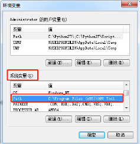
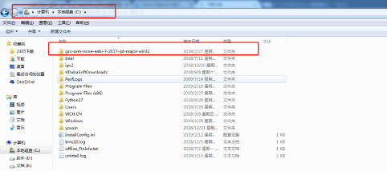
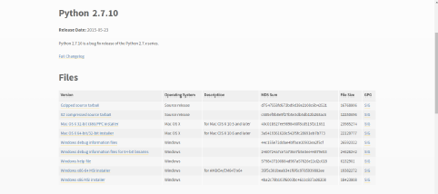
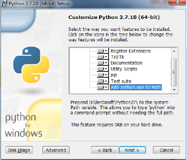
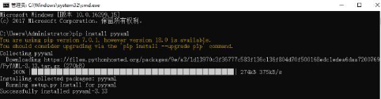

<h1 align="center">
  OpenCPU Demo
</h1>

<h4 align="center">
  👋 Lierda NB-IoT Team
</h4>

  <!-- <a href="https://travis-ci.org/lierda-nb-iot-team/OpenCPUdemo"> -->
    
  <!-- </a> -->
  

<!-- <h3 align="center">
  <a href="./README_EN.md">
  Change to English
</h3> -->

# 1 OpenCPU 相关例程说明
#### 写在前面  
以下例程基于LiteOS设计，LiteOS入门操作指南请移步[LiteOS内核教程](https://liteos.github.io/tutorials/kernel/)

## 目录构成:

*每个工程文件夹内包含`.fwpkg固件包`可直接烧录看现象*

| 目录 | 内容 |
| :----------- | :--------------- |
| OpenCPU Peripheral   | 包含各种传感器和外设的使用例程|
| Network Communication | 包含网络通信例程|
| Application Demo| 包含综合应用例程|
| Doc | 包含所有使用上的详细说明|
| Tool Chain | 包含固件升级以及UElog查看等工具|

## OpenCPU Peripheral目录包含:

| 目录              | 内容 |
| :--------------- | :---------------------------- |
| VBAT voltage acquisition| Vbat脚电压相关使用例程及说明文档|
| Temperature and humidity sensor data acquisition| HDC1000温湿度传感器相关使用例程及说明文档|
| Acceleration sensor| LIS3DH三轴加速度传感器相关类使用例程及说明文档|
| LED flashing| LED灯使用例程及说明文档 |
| Light sensor| 光线传感器使用例程及说明文档 |
| GPS sensor data acquisition| GPS芯片相关使用例程及说明文档|
| Button| 按键中断相关使用例程及明文档|
| Analog measurement（ADC）| ADC采样相关使用例程及说明文档|
| Analog output（DAC）| DAC输出相关使用例程及说明文档|
| Low power adaptation | 低功耗使用例程及说明文档 |
| Breathing light | 呼吸灯PWM输出使用例程及说明文档 |
| Flash memory | SPI读写FLASH使用例程及说明文档 |

## Network Communication目录包含: 

| 目录              | 内容 |
| :--------------- | :---------------------------- |
| Search network and Attach| 网络连接相关使用例程及说明文档|
| UDP send and receive data| UDP数据收发相关使用例程及说明文档|
| TCP send and receive data| TCP数据收发相关使用例程及说明文档|
| LwM2M send and receive data| LWM2M数据收发相关使用例程及说明文档|
| FOTA adaptation and testing| FOTA适配相关使用例程及说明文档|

## Application Demo目录包含: 

| 目录              | 内容 |
| :--------------- | :---------------------------- |
| Temperature and humidity collector simulation| 温湿度采集器应用相关使用例程及说明文档|
| Street light simulation| 路灯应用相关使用例程及说明文档|
| Tracker simulation| 定位器应用相关使用例程及说明文档|

# 2 OpenCPU 环境搭建说明

### 1.1 编译器 -gcc
B500 编译调用 的 GCC 编译器 版本与 B300SP2&B300SP5 不一样，若要支持B300SP2&B300SP5 和 B500 则需要安装两个不同版本的 GCC 编译器。具体的安装方法如下：  
#### 1.1.1 B300SP2&B300SP5  
下载 [GCC 编译器安装文件](https://launchpad.net/gcc-arm-embedded/+download)
进入软件下载界面下载所需的软件安装包如图 1-1  

  

点击下载好的软件进行安装，需要注意的是安装完成后，确保选择了“添加环境变量的路径”选项如图 1-2  

  

进入windows 命令行输入 arm-none-eabi-gcc -v 检查 gcc 版本，判断 gccs 是否安装成功，如图 1-3  

  

如果查不到版本信息，检查环境变量是否添加成功如图 1-4.如果环境变量里查不到 gcc 的安装路径，请根据自己 gcc 安装的路径添加环境变量。  

  

#### 1.1.2 B500SP1
下载[GCC 编译器安装文件](https://armkeil.blob.core.windows.net/developer/Files/downloads/gnu-rm/7-2017q4/gcc-arm-none-eabi-7-2017-q4-major-win32.zip)并安装，只需将下载的zip 文件解压放到 C 盘的根目录即可，如图 1-5  

  

然后，添加环境变量 ` C:\gcc-arm-none-eabi-7-2017-q4-major-win32\bin `
如图 1-6  

### 1.2 Python 2.7  
#### 1.2.1 Python 2.7 安装  
Scons 是一个用于基于 Python2.7 的软件构建的工具。确保在安装 Scons 之前安装 [Python 2.7](https://www.python.org/downloads/release/python-2710/)
如图 2-1  

  

点击下载好的软件进行安装，需要注意的是在安装过程中，确保选择了“添加环境变量的路径”选项如图 2-2 所示。点击下一步完成安装。

  

### 1.2.2 pywin32 安装
下载对应的[pywin32](https://sourceforge.net/projects/pywin32/files/pywin32/Build%20221/)

`注意：下载的版本和 Python 2.7 相对应` 

如图 2-3  

  

点击下载好的.exe 文件安装。

`注意：检查系统环境变量中是否添加了 C:\Python27\;C:\Python27\Scripts`

如果没有添加，一定要添加上去如图 2-4  

  

### 1.2.3. 安装 Python PyYAML 库

进入windows 命令行输入 python 检查Python 是否安装成功，如图 3-1  

  

`注意：若果没有安装成功请检查环境变量是否添加正确`

安装PyYAML 库，在命令行输入 `pip install pyyaml` 

如图 2-6  

### 1.2.4 Scons 安装

下载 [Scons](https://sourceforge.net/projects/scons/files/scons/2.4.0/ )  

`注意：Scon 应该安装在 Python 的脚本文件夹(.\Python 27\Script)中`

## 1.3 IDE – Eclipse 安装  

`注意：检查Java 是否安装，进入命令行，输入 java -version`  

若没安装请先安装 [Java](https://www.java.com/en/download/)

如图 3-1  

  

下载 [Eclipse](https://www.eclipse.org/downloads/packages/release/mars/2/eclipse-ide-cc-developers)  

Eclipse 插件安装（Scons）  
打开Eclipse，按一下操作步骤进入 Scons 安装界面  

如图 3-2  

  

1.点击选项栏：`Help`
2.点击help 下子选项栏：`Install New Software...`
3.点击 `Work with` 后的 `Add`  
4.填入下列信息 `Scons http://sconsolidator.com/update`

如图 3-3  

 

5.从插件列表中为 scons 选择 Eclipse 插件  
6.单击 Next，并按照说明执行  

# 3 OpenCPU 工程导入说明
`注意：工程的路径和工程名不能包含中文；工程的路径尽量不要太深，5 层以内`

1.点击选项栏 `File`  
2.点击 `File` 子选项栏的 `Import... `进入导入工程界面如图 3-1，点击 `c/c++`选项栏，选择  `New SCons project from existing source`  单击下一步  

选择要导入的工程文件路径点击确定，填写相关信息，点击 `Finish`。  

  

