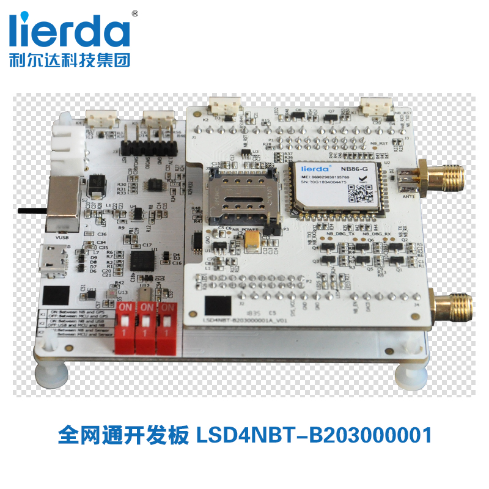

<h1 align="center">
  OpenCPU Demo
</h1>

<h4 align="center">
  👋 Lierda NB-IoT Team
</h4>

  <!-- <a href="https://travis-ci.org/lierda-nb-iot-team/OpenCPUdemo"> -->
    
  <!-- </a> -->
  

<!-- <h3 align="center">
  <a href="./README_EN.md">
  Change to English
</h3> -->

# 1 OpenCPU 相关例程说明
#### 写在前面 
例程的是基于Lierda NB86-G EVK设计，NB86-G EVK资料获取请移步：[NB86 EVK基本资料集](https://github.com/lierda-nb-iot-team/Lierda_NB86_EVK)  ,NB86-G EVK获取请移步：[NB86 EVK](https://item.taobao.com/item.htm?spm=a1z10.5-c.w4002-21080581561.13.565878241Htgvt&id=578262725191)              
   
例程的软件部分基于LiteOS设计，LiteOS入门操作指南请移步[LiteOS内核教程](https://liteos.github.io/tutorials/kernel/)

## 目录构成:

*每个工程文件夹内包含`.fwpkg固件包`可直接烧录看现象*

| 目录 | 内容 |
| :----------- | :--------------- |
| 1.Reference   | OpenCPU相关资料说明|
| 2.Tool_Chain | 工具链的搭建及开发所需的软件|
| 3.OpenCPU_Peripheral| OpenCPU外设相关例程|
| 4.Network_Communication | OpenCPU网络连接及FOTA升级相关例程|
| 5.Application_Demo | 综合应用例程（模拟水表、路灯、温湿度采集器、定位器）|

## Tool_Chain目录包含:

| 目录              | 内容 |
| :--------------- | :---------------------------- |
| 1.开发环境搭建| 开发环境搭建说明|
|2.工程导入及代码编译|工程导入及代码编译说明|
|3.固件生成及烧录|固件生成及烧录说明|
|tool|开发所需软件|
## OpenCPU_Peripheral目录包含:

| 目录              | 内容 |
| :--------------- | :---------------------------- |
| VBAT voltage acquisition| Vbat脚电压相关使用例程及说明文档|
| Temperature and humidity sensor data acquisition| HDC1000温湿度传感器相关使用例程及说明文档|
| Acceleration sensor| LIS3DH三轴加速度传感器相关类使用例程及说明文档|
| LED flashing| LED灯使用例程及说明文档 |
| Light sensor| 光线传感器使用例程及说明文档 |
| GPS sensor data acquisition| GPS芯片相关使用例程及说明文档|
| Button| 按键中断相关使用例程及明文档|
| Analog measurement（ADC）| ADC采样相关使用例程及说明文档|
| Analog output（DAC）| DAC输出相关使用例程及说明文档|
| Low power adaptation | 低功耗使用例程及说明文档 |
| Breathing light | 呼吸灯PWM输出使用例程及说明文档 |
| Flash memory | SPI读写FLASH使用例程及说明文档 |

## Network Communication目录包含: 

| 目录              | 内容 |
| :--------------- | :---------------------------- |
| Search network and Attach| 网络连接相关使用例程及说明文档|
| UDP send and receive data| UDP数据收发相关使用例程及说明文档|
| TCP send and receive data| TCP数据收发相关使用例程及说明文档|
| LwM2M send and receive data| LWM2M数据收发相关使用例程及说明文档|
| FOTA adaptation and testing| FOTA适配相关使用例程及说明文档|

## Application Demo目录包含: 

| 目录              | 内容 |
| :--------------- | :---------------------------- |
| 1.WaterMeterSimulation| 模拟水表应用相关使用例程及说明文档|
| 2.StreetLightSimulation| 模拟路灯应用相关使用例程及说明文档|
| 3.TemperatureAndHumidityCollectorSimulation| 温湿度采集器应用相关使用例程及说明文档|  
| 4.TrackerSimulation| 定位器应用相关使用例程及说明文档|
